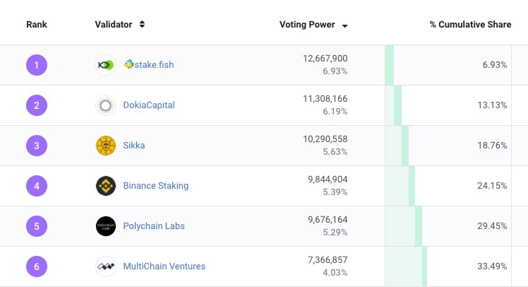
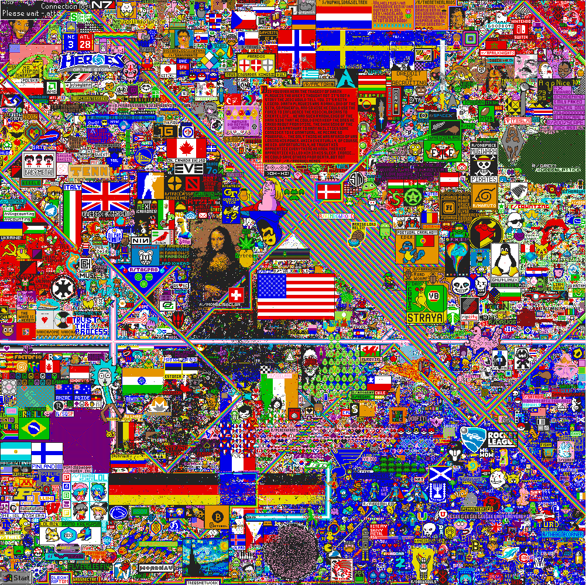

# ✨🎨 AstroCanvas ✨🎨
### Decentralize Staking, Colorfully 🌈

### Introduction

Stake decetralization, or the spread of voting power across multiple validators, is one crucial element to increase the robustness and decentralization of a public proo-of-stake blockchain. As voting power gets concentrated to the hands of a few powerful validators, number of colluding entities needed to create byzantine behavior reduces.

As for the Cosmos Hub, only the top 6 validators need to collude in order to amass 33.4% of voting power–which can effectively halt the blockchain. While whether such actions are realistic may be questionable, it's no doubt that there is room for improvement.

While ideas such as variable staking reward rate, variable slashing rate, and more have been proposed, such ideas take significant economic research and security analysis to ensure the cryptoeconomics of the blockchain remains robust.

### Paint the picture of how you want **your** Cosmos to looks like

> So what if we could incentivize stake decentralization without changing the fundamentals of the blockchain cryptoeconomics, by using  **personal amusement**?

Astrocanvas is a game and a radical social experimentation in stake decentralization. We use elements of entertainment, scarcity, competition, and economics to incentivize voting power distribution of a proof-of-stake blockchain.

We were inspired by the 2017 Reddit april fools project 'Place'. Where each account was allowed to change the color of one pixel on a 1000x1000 pixel canvas–**but only every 5 minutes**. In just 72 hours, over 1 million users participated. During that time, factions were formed, betrayals happened, virtual wars were fought, and ultimately a picture was drawn that represented the community of people that drew it. Place was an experimentation of digital scarcity, human psychology, and competition.

In Astrocanvas, delegators are given specific `colorToken` that represents the right to change one pixel in the canvas when they delegate their staking token to a Hub validator. 

The catch? **Not all `colorToken` are the same.**

Delegators can earn `colorToken` of a specific color (white, black, red, etc) depending on the voting power of the delegated validator. So for example, validator with *#1 to #10* rank in voting power gives delegators `colorTokenWhite` which only allows you to place a white pixel on the canvas. If you want to place a blue pixel, you need `colorTokenBlue` which you may only receive when you delegate to a validator with voting power ranging from *#80 to #90*.

The idea here is as following:
* People want to draw specific 'art' on the canvas, which would require a wide set of colors to do. Which will disincentivize staking to a high voting power validator in order to acquire other colors.
* The picture drawn on the canvas, and the dominance of a specific color will accurately reflect the community of delegators and the state of the hub.
* Validators will incentivize drawing of specific images that are dominant in the color of their respective `colorToken` in order to bring in delegations.
* Potentially many factions and sub-communities will form in order to own a piece of the digitally scarce canvas.

### A few quirks and features

* The `colorToken` is burnt when it's used to change the pixel on the Astrocanvas
* The amount of `colorToken`s you receive is relative to the amount you stake
* You receive new `colorToken`s every `n` blocks
* You can only use `colorToken`s every `n` blocks
* More in progress...

### The tools we used

We have used an early implementation of ICS27(Interchain Accounts) for interchain staking and implemented IBC cross-chain token transfers.

The AstroCanvas zone is built using a modified Cosmos-SDK, and records the state of the canvas (and each of the pixels) on the ledgers.
